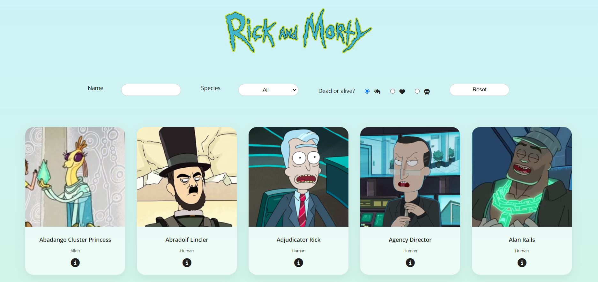
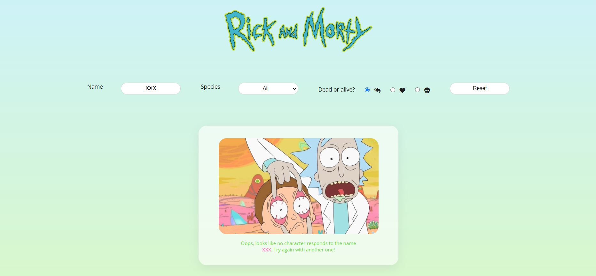
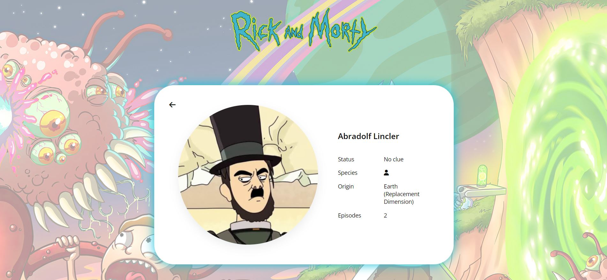
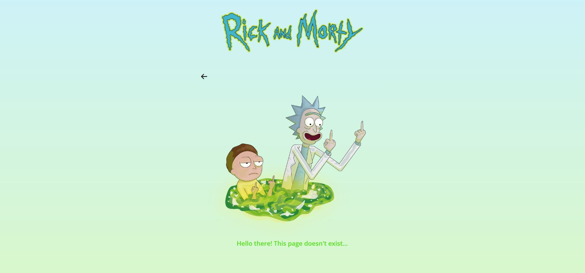
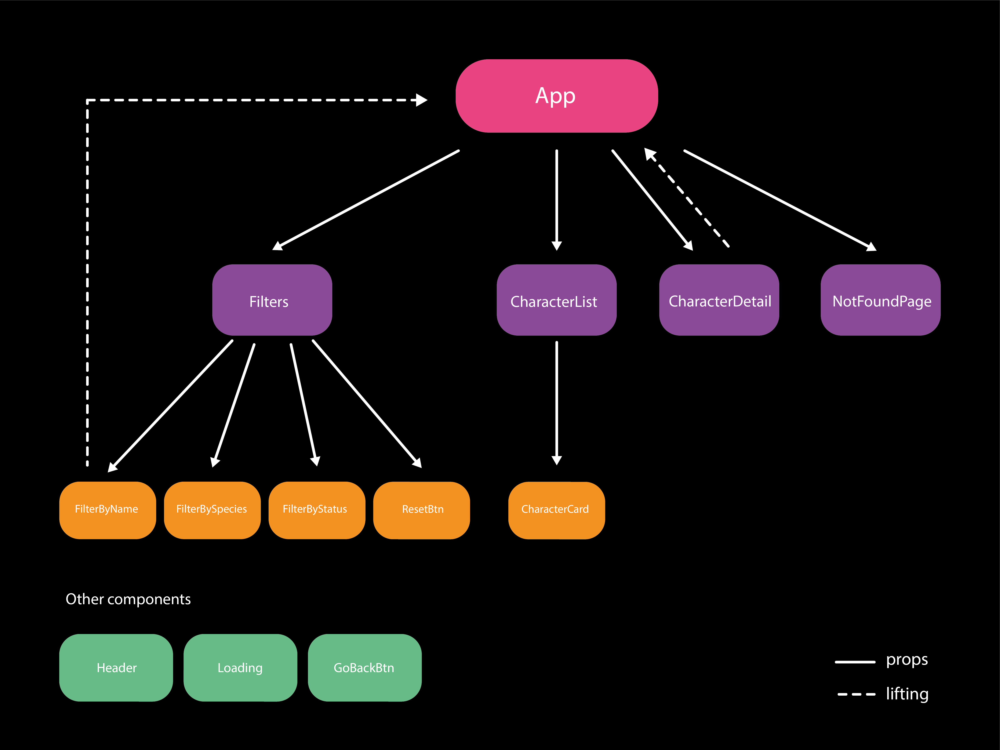

# Module 03 | Final review | Ana Bollain

## Introduction

Hey there! Welcome to my project ✨

This exercise responds to the final review of the **third module** within **Adalab's Web Development Bootcamp**. The main goal is to create a responsive web application with a series of functionalities regarding interactivity with Javascript's **React** framework. 

The theme is **Rick and Morty**, an Emmy award-winning half-hour animated hit comedy series on Adult Swim that follows a sociopathic genius scientist who drags his inherently timid grandson on insanely dangerous adventures across the universe.

## Description

The web application allows the user to consult all characters within the series, being able to search them by name, species (human or alien) and status (dead or alive). When clicking in each character, the site will lead the user to a new page with further information regarding the clicked character. 

Some extra functionalities have been implemented to improve the user's experience, such as: 

- All searches are saved in the user's local storage, so when refreshing the page they will still be available. 
- If the user wants to restart a new search from scratch, she or he will only have to click the reset button.  
- If no characters match the user's search, a customized message will appear on the screen.
- If the introduced URL does not exist, the user will be lead to a specific site, from which she or he will be capable of going back to the home page either by clicking the go back button, or the header logo. 

You will find below some images of each state of the application, as well as some additional information of each one:

**Main Page**



*With:*
*- A text input to search characters by name*
*- A select input to search characters by species (human or alien)*
*- A radio input to search characters by status (all, dead or alive)*
*- A reset button to restart the search from scratch*
*- A list with the photo, name and species of each character*

**No characters found**



*With:*
*- If the user types XXX, a card with a message will inform her or him that the typed character XXX does not exist*

**Character Detail**



*With:* 
*- A card showing the photo, name, status, species, origin and number of episodes where the character has appeared*
*- A go back button that leads the user to the main site*
*- The user can also return to the main site by clicking in the logo from the header*

**Not Found Page**



*With:*
*- A message to inform the user that the typed URL does not exist*
*- A go back button that leads the user to the main site*
*- The user can also return to the main site by clicking in the logo from the header*

**Hope you enjoy the experience!** 🎉

## Requirements

With a basic template as the starter point, the exercise consists on developing a web-site using the following elements:

- HTML
- Sass
- Javascript
- React framework
- JSX
- Interactions with the user
- API request

The following **requirements** have to be respected:

0. *Design*. Basic structure and design for the web application, with a search input to filter characters by their name; as well as a list of articles with the photo, name and species of each character. When clicking in each character, a new layout with a unique article has to be designed, with the photo, name, species, status, location and number of episodes where the character has appeared.
1. *Initial state*. When loading the page, all characters must appear in the main section, using an **API request** to obtain all the data. The service for the request can be found in https://rickandmortyapi.com/documentation/#get-all-characters. For each character obtained in the result, a card with the following information must be rendered: photo, name and species (human or alien). 
2. *Search by name input*. The user can search characters by their name, filling the input, whether the introduced text is in lowercase or uppercase.
3. *Components*. The SPA should have a minimum series of **components**, listed here below: 
    - Filter: responding to the search by name input.
    - CharacterList: responding to the character list.
    - CharacterCard: responding to each article in the character list.
    - CharacterDetail: responding to the detail page with specific information for each character. 
4. *Character detail*. When clicking in a character, his or her information will appear in full screen mode. To do so, Routes and Link from **'react-router-dom'** library must be implemented, creating static and dynamic routes. In this page, besides the photo, name and species of each character, the user will also be able to consult the planet origin, number of episodes and whether they are dead or alive. 
5. *General details*. The following functionalities have to be respected:
- If the user presses intro when typing in the search by name input, whe should prevent the browser from refreshing or changing the URL.
- If no character responds to the user's search by name, a text should appear with the following message or similar: 'There are no characters matching the word ...'.
- The name filter must work whether the user introduces text in lowercase or uppercase.
- When entering in the detail of a character and going back to the homepage, the input must show the user's previous search.

**Bonus**

6. *Improve design*. Open to creativity with a responsive design for smaller devices.
7. *Supported URL*. The URL for each character must be supported, meaning that if the user types directly the address in her or his browser, the site will still work. If the searched URL does not exist, an error message should appear on the screen. 
8. *Sort*. Sort the returned API data by character name. 
9. *More filters*. Add other filters. 

**Personal improvements**

The following extra functionalities have been implemented in the project to improve the user's experience:

10. *Reset button*. A reset button so the user can restart a new search from scratch.
11. *Local Storage*. All search input information is saved in the user's local storage, so that it will remain available if he or she refreshes the page.
12. *Loading*. If the API request takes more time than usual, a new page will appear in the screen to warn the user that the page is still loading. 
13. *Testing*. Some unit testing has been implemented to ensure the application is working correctly.
14. *Background Image*. The background changes from one page to another, to make the user's experience more dynamic. 

## Tools

The project has been developed with a customized **'React Starter Kit'**, a framework created in node and gulp that has pre-installed and pre-configured functionalities. It also contains an HTML template engine, a Sass and React preprocessor and a local server, among other elements.

The following tools have been used when solving the project:

- Languages
    - HyperText Markup Language: **HTML5**.
    - JavaScript XML: **JSX**.
- CSS Pre-processor: **Sass**.
    - Partials for each React component.
    - Variables, mixins and functions.
    - Display: Flexbox and Grid. 
    - Box model (size, padding and margin).
    - Position: relative and absolute. 
    - Transitions.
    - Animations.
- Javascript
    - Conditionals
    - Events
    - Functions
    - Objects
    - Arrays
    - Loops
    - Array methods such as map, filter and find.
 - JavaScript Framework: **React Native**.
    - **Tree-structured** hierarchy.
    - Identify unique and reusable **components**.
    - State variables: **useState**.
    - Props: information **flow** from superior to inferior components.
    - Lifting: working with **events** and moving information **up**.
    - API Request: retrieve **data from a server** with **useEffect**.
    - **Clean** returned data from **API request**. 
    - Routes and Links: SPA with **react-router-dom**.
    - Static and **dynamic** routes.
    - Manage **events** in each component.
    - Local Storage: **LocalStorage**.
    - PropTypes to ensure there are no errors in the information flow.
    - Destructuring and Spread Operator to optimize code.
 - Task Automation: **Gulp**.
 - Git Version Control: **GitHub**.
 - **JSON**.
 - Command shell.
 - Chrome DevTools for debugging. 

You will find below a diagram of the components that compose the project:



## Steps to follow if you want to use this project in your computer

This project has been developed with a React Starter Kit, where a series of pre-installed and pre-configured tools and dependencies are available to optimize and organize the project. 

To be able to work with it, you will have to follow the next steps:

1. Create your repository.
2. Copy all project files in the root file of your repository.
3. Open the shell command and install all necessary dependencies listed here below:

```bash
npm install
npm install node-sass
npm install react-router-dom
```
4. Once all dependencies have been installed, you will be able to run the project typing in the shell command:

```bash
npm start
```
5. This command:
- Opens a new window in Google Chrome and shows the web application, just as the VS Code Live Server (Go Live) plugin does.
- While opened, it **observes** all the files within the `src/` file, so when any of them have been changed it will **refresh your page in Google Chrome**.
- It also **processess the files** HTML, Sass / Css and JSX so that the browser is able to read them. For instance:
    - It converts Sass into Css.
    - It converts JSX into HTML and Javascript.

6. Once you have executed `npm start`, you can start to work with all files within `src/` and code comfortably.

## Final Result

You can have a look of the outcome in Github Pages: **[Rick and Morty](http://beta.adalab.es/modulo-3-evaluacion-final-anabollain/)**

Hope you enjoy the project as much as I did 😉

**Thank you!**


